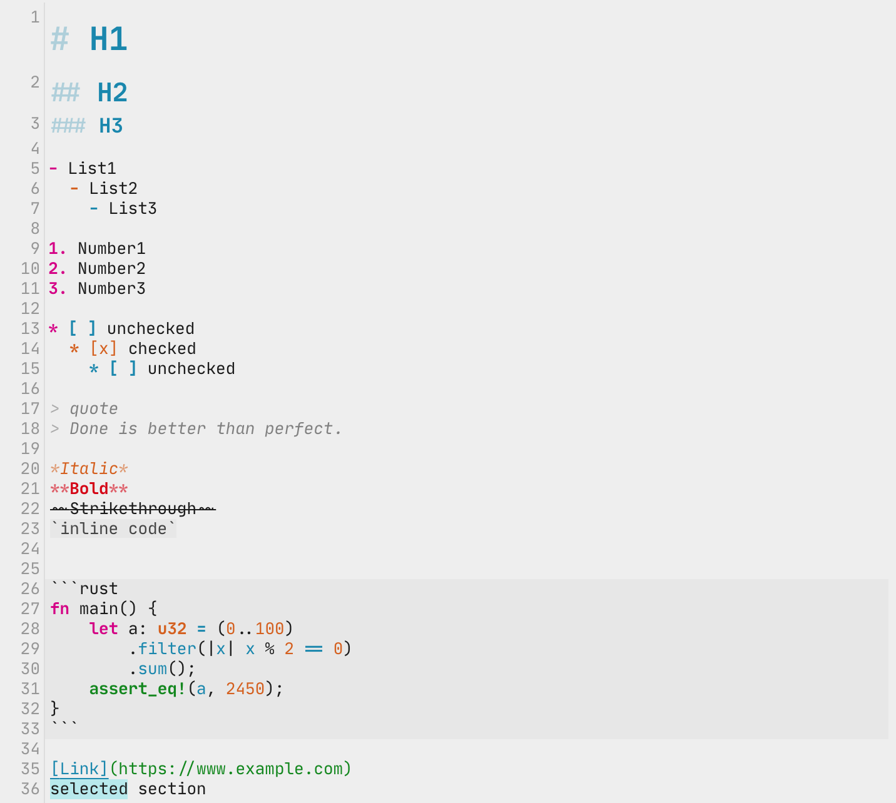

# Papercolor Syntax Theme for Inkdrop

Papercolor is a color scheme inspired by Google's Material design.
Originally made for vim: [NLKguyen/papercolor-theme](https://github.com/NLKNguyen/papercolor-theme).

## Install(CLI)

```
ipm install papercolor-syntax
```

## Screenshot


## Contribution
Issues & PRs are welcome that enhance the theme!